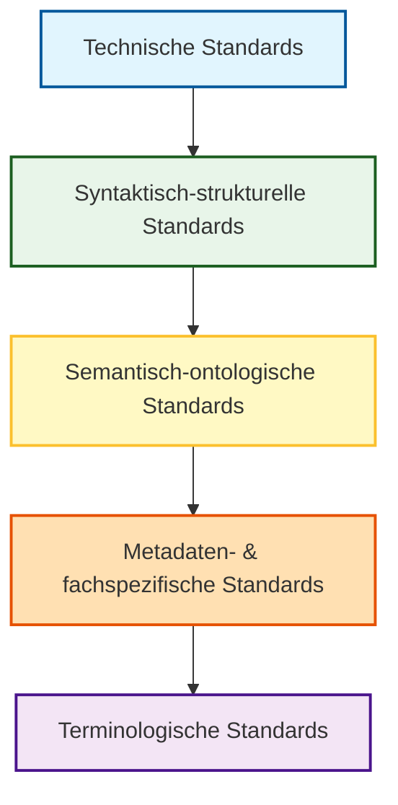
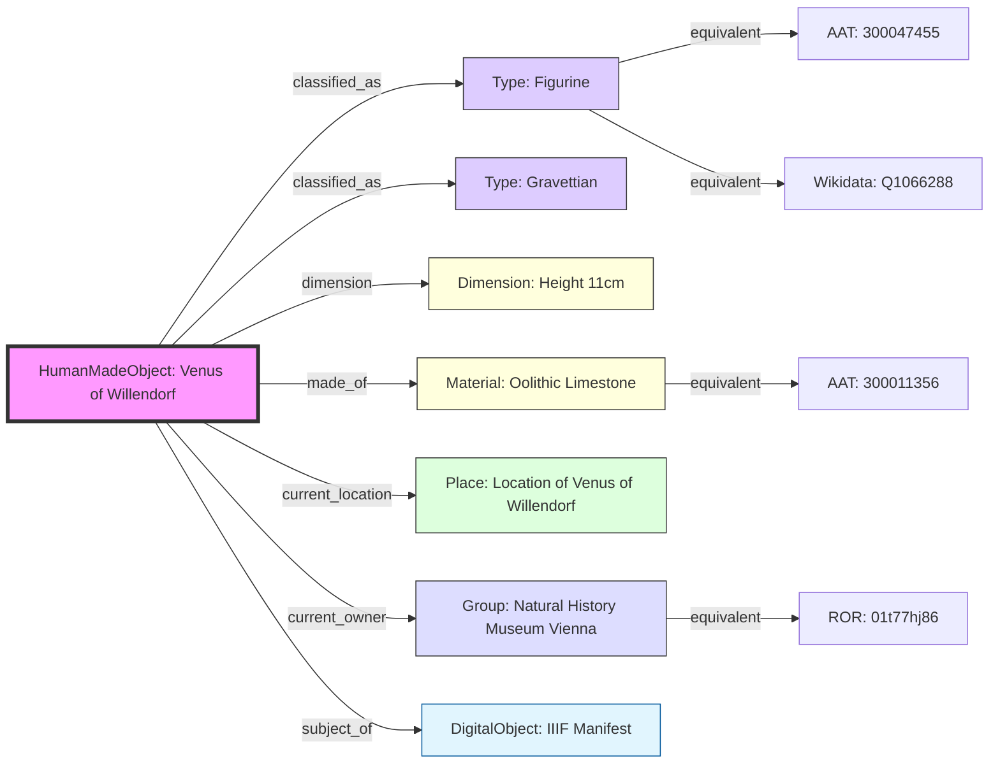

# Infos und Materialien zum Thema "digitale Standards"

## Mit besonderem Fokus auf den GLAM Bereich (Galleries, Libraries, Archives, Museums)

Stefan Eichert


*Quelle: [xkcd.com/927](https://xkcd.com/927), Lizenz: [CC BY-NC 2.5](https://creativecommons.org/licenses/by-nc/2.5/)*

Dieses Repository soll einen Überblick über die vielschichtigen Ebenen und Dimensionen digitaler
Standards bieten.
Das Verständnis dieser Konzepte bildet eine wichtige Grundlage für eine gemeinsame Verständigung
sowie die zielgerichtete Anwendung von Standards in der praktischen Umsetzung von
Digitalisierungsprojekten.

## Standard ist nicht gleich Standard

Bevor näher auf einzelne Standards eingegangen wird, soll an dieser Stelle kurz besprochen werden,
welche Ebenen bzw. Dimenstionen von Standards im GLAM Bereich und generell im Bereich der Digitalisierung vorkommen.

| Standards-Ebene               | Funktion                                                               | Beispiele                                          |
|:------------------------------|:-----------------------------------------------------------------------|:---------------------------------------------------|
| Technisch                     | Infrastruktur, Protokolle und Schnittstellen                           | HTTP, IIIF, REST                                   |
| Syntaktisch-strukturell       | Datenformate und formale Datenstrukturen                               | XML, JSON, CSV                                     |
| Semantisch-ontologisch        | Bedeutungen, Klassen und Beziehungen                                   | CIDOC CRM, RDF, RDFS/OWL                           |
| Metadaten- und fachspezifisch | Standardisierte Beschreibungsschemata und fachspezifische Datenmodelle | ABCD(-EFG), EDM, Darwin Core, Dublin Core, ISAD(G) |
| Terminologisch                | Kontrollierte Vokabulare, Thesauri und Normdaten                       | Getty AAT, GND, ROR                                |

## Technische Standards

Technische Standards bilden das Rückgrat der digitalen Kommunikation. Sie definieren die grundlegende Infrastruktur, Protokolle und Schnittstellen, die den Datenaustausch zwischen verschiedenen Systemen ermöglichen. Ein wesentlicher Aspekt ist hierbei auch die Nutzung offener und wohl-dokumentierter Dateiformate, um die Interoperabilität und Langzeitverfügbarkeit von Daten zu sichern.

### Beispiele und Funktionen:

- **HTTP (Hypertext Transfer Protocol):** Die Basis für die Datenübertragung im World Wide Web.
- **IIIF (International Image Interoperability Framework):** Ein Standard für die Bereitstellung von hochauflösenden Bildern und Medien über das Web, besonders wichtig im GLAM-Bereich.
- **REST (Representational State Transfer):** Ein Architekturstil für Programmierschnittstellen (APIs), der eine einfache und standardisierte Kommunikation zwischen Webdiensten erlaubt.
- **Offene Dateiformate:** Standards wie **glTF**, **PNG** oder **PDF/A** stellen sicher, dass digitale Inhalte unabhängig von spezifischer Software langfristig zugänglich und lesbar bleiben.

## Syntaktisch-strukturelle Standards

Diese Ebene definiert die Syntax und die formale Struktur der Daten. Sie legt fest, wie Daten technisch organisiert und formatiert werden, damit sie von verschiedenen Softwareanwendungen korrekt gelesen und verarbeitet werden können.

### Beispiele und Funktionen:

- **XML (Extensible Markup Language):** Ein flexibles Format zur hierarchischen Strukturierung von Daten, das sowohl menschen- als auch maschinenlesbar ist.
- **JSON (JavaScript Object Notation):** Ein kompaktes Datenformat, das besonders häufig für den Datenaustausch in Webanwendungen genutzt wird.
- **CSV (Comma-Separated Values):** Ein einfaches Textformat für tabellarische Datenstrukturen.

## Semantisch-ontologische Standards

Semantische Standards legen die Bedeutung (Semantik) der Daten fest. Sie definieren Klassen, Eigenschaften und Beziehungen zwischen Objekten, um ein gemeinsames Verständnis der Inhalte über Systemgrenzen hinweg zu ermöglichen.

### Beispiele und Funktionen:

- **RDF (Resource Description Framework):** Ein grundlegendes Modell zur Beschreibung von Ressourcen im Web mittels Tripeln (Subjekt, Prädikat, Objekt).
- **RDFS/OWL:** Sprachen zur Definition von Schemata und Ontologien, um komplexe Wissensmodelle und logische Verknüpfungen abzubilden.
- **CIDOC CRM:** Ein objektorientiertes Referenzmodell für Informationen im Bereich des kulturellen Erbes.

## Metadaten- und fachspezifische Standards

Diese Standards basieren oft auf syntaktischen und semantischen Grundlagen, sind jedoch auf spezifische Anwendungsdomänen oder Objekttypen zugeschnitten. Sie bieten strukturierte Schemata zur Beschreibung von Ressourcen.

### Beispiele und Funktionen:

- **Dublin Core:** Ein Set einfacher Metadatenelemente zur universellen Beschreibung digitaler Ressourcen.
- **EDM (Europeana Data Model):** Ein Standard zur Repräsentation von Kulturerbe-Daten für die Aggregation in Portalen wie Europeana.
- **Darwin Core / ABCD:** Standards für den Austausch von biologischen Biodiversitätsdaten.
- **ISAD(G):** Ein internationaler Standard zur Verzeichnung von Archivgut.

## Terminologische Standards

Terminologische Standards (auch Wissensorganisationssysteme genannt) stellen sicher, dass für die Beschreibung von Inhalten einheitliche Begriffe verwendet werden. Dies umfasst kontrollierte Vokabulare, Thesauri und Normdaten.

### Beispiele und Funktionen:

- **GND (Gemeinsame Normdatei):** Eine vom Deutschen Bibliotheksnetzwerk gepflegte Normdatei für Personen, Schlagworte und Körperschaften.
- **Getty AAT (Art & Architecture Thesaurus):** Ein strukturierter Thesaurus für Begriffe aus Kunst, Architektur und Kulturgeschichte.
- **ROR (Research Organization Registry):** Ein globales Register zur eindeutigen Identifikation von Forschungseinrichtungen.

## Zusammenspiel und Verknüpfung der Ebenen

Die vorgestellten Ebenen existieren nicht isoliert nebeneinander, sondern bauen aufeinander auf und greifen ineinander. Man kann sie sich wie einen "Stack" oder Schichtenmodell vorstellen:



1.  **Fundament:** Technische Standards (z. B. HTTP) stellen die Verbindung her.
2.  **Struktur:** Syntaktische Standards (z. B. JSON) geben vor, wie das "Gefäß" für die Daten aussieht.
3.  **Logik:** Semantische Standards (z. B. RDF) definieren, wie Aussagen innerhalb dieser Struktur getroffen werden.
4.  **Kontext:** Metadatenstandards (z. B. Dublin Core) nutzen diese Logik und Struktur, um fachspezifische Beschreibungen (z. B. "Titel", "Urheber") zu definieren.
5.  **Präzision:** Terminologische Standards (z. B. GND) liefern die exakten Werte, die in die Metadatenfelder eingetragen werden, um Mehrdeutigkeiten zu vermeiden.

Erst durch das nahtlose Zusammenspiel dieser Ebenen entsteht echte **Interoperabilität**: Daten können nicht nur übertragen, sondern auch von fremden Systemen inhaltlich korrekt interpretiert und verarbeitet werden.

## Beispiel: Linked Art (JSON-LD) Visualisierung

Als praktisches Beispiel für die Anwendung von semantischen Standards (Linked Art / JSON-LD) folgt hier eine Visualisierung des Objekts "Venus von Willendorf" aus der THANADOS-Datenbank:



*Quelle der Daten: [THANADOS API](https://thanados.openatlas.eu/api/entity/196952?format=loud)*

### JSON-LD Quelldaten (Auszug)

Hier ist ein repräsentativer Ausschnitt der JSON-LD Daten für die "Venus von Willendorf":

```json
{
  "@context": "https://linked.art/ns/v1/linked-art.json",
  "id": "https://thanados.openatlas.eu/api/uuid/efe4b69e-95b1-457c-87ba-cc640e1efc76",
  "type": "HumanMadeObject",
  "_label": "Venus of Willendorf",
  "classified_as": [
    {
      "id": "https://thanados.openatlas.eu/api/uuid/7f9aab71-3a12-4ac3-a5ce-ae272b490acc",
      "type": "Type",
      "_label": "Figurine",
      "equivalent": [
        {
          "id": "https://vocab.getty.edu/aat/300047455",
          "type": "Type",
          "_label": "Figurine"
        }
      ]
    }
  ],
  "dimension": [
    {
      "type": "Dimension",
      "_label": "Height 11cm",
      "value": 11,
      "unit": {
        "id": "http://vocab.getty.edu/aat/300379097",
        "type": "MeasurementUnit",
        "_label": "cm"
      }
    }
  ],
  "made_of": [
    {
      "id": "http://vocab.getty.edu/aat/300011356",
      "type": "Material",
      "_label": "oolithic limestone"
    }
  ],
  "subject_of": [
    {
      "id": "https://bitem.at/iiif/234710.json",
      "type": "DigitalObject",
      "_label": "IIIF Manifest",
      "format": "application/ld+json",
      "conforms_to": [
        {
          "id": "http://iiif.io/api/presentation/3/context.json",
          "type": "InformationObject"
        }
      ]
    }
  ],
  "current_owner": [
    {
      "id": "https://thanados.openatlas.eu/api/uuid/230198f1-5835-4679-b1d7-b873d6b0404f",
      "type": "Group",
      "_label": "Natural History Museum Vienna",
      "equivalent": [
        {
          "id": "https://ror.org/01t77hj86",
          "type": "Group",
          "_label": "Natural History Museum Vienna"
        }
      ]
    }
  ]
}
```

Die vollständigen Daten umfassen über 3000 Zeilen und können direkt über den oben genannten Link eingesehen werden.

## Lizenz

Dieses Werk ist lizenziert unter
einer [Creative Commons Namensnennung 4.0 International Lizenz](http://creativecommons.org/licenses/by/4.0/).
Details dazu finden Sie in der Datei `LICENSE.txt`.
